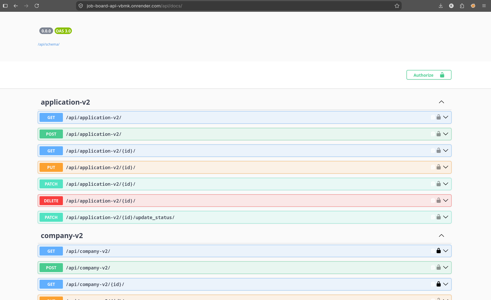

# Job Board API

A REST API for a job board platform, built with Django and Django REST Framework. Recruiters create companies and post jobs; job seekers browse, search, and apply — with role-based permissions enforced at every step.

**Live API:** https://job-board-api-vbmk.onrender.com
**Interactive docs (Swagger):** https://job-board-api-vbmk.onrender.com/api/docs/
**Alternative docs (ReDoc):** https://job-board-api-vbmk.onrender.com/api/redoc/

> Note: hosted on Render's free tier — the first request after inactivity may take 30–50 seconds while the instance wakes up.

## Features

- **JWT authentication** (access + refresh tokens) via `djangorestframework-simplejwt`
- **Role-based permissions** — only a company's owner can edit/delete it or post jobs under it; only a job's owning recruiter can update an application's status
- **One application per user per job**, enforced at both the database and API level with a clean validation error instead of a server crash
- **Filtering, search, and ordering** on job listings (location, job type, keyword search, sort by deadline/salary)
- **Pagination** and **rate limiting** (separate limits for anonymous vs. authenticated users)
- **Background tasks with Celery + Redis** — notifies a recruiter when someone applies, and a scheduled daily task that automatically deactivates jobs past their deadline
- **Auto-generated API documentation** with `drf-spectacular`
- **Automated test suite** covering the ownership and permission rules, using DRF's `APIClient`
- **CORS** configured for frontend integration

## Tech stack

| Layer | Tools |
|---|---|
| API | Django, Django REST Framework |
| Auth | JWT (`djangorestframework-simplejwt`) |
| Database | PostgreSQL (production), SQLite (local dev) |
| Background jobs | Celery, Redis, Celery Beat |
| Docs | drf-spectacular (Swagger / ReDoc) |
| Filtering | django-filter |
| Deployment | Render, Gunicorn, WhiteNoise |
| Testing | Django `TestCase`, DRF `APIClient` |

## API overview

| Method | Endpoint | Description |
|---|---|---|
| POST | `/api/token/` | Log in, get access + refresh tokens |
| POST | `/api/token/refresh/` | Exchange a refresh token for a new access token |
| GET / POST | `/api/company-v2/` | List / create companies |
| GET / PUT / DELETE | `/api/company-v2/{id}/` | Retrieve, update, or delete a company (owner only for writes) |
| GET / POST | `/api/job-v2/` | List (public) / create (owner only) jobs — supports `?location=`, `?job_type=`, `?search=`, `?ordering=` |
| GET / PUT / DELETE | `/api/job-v2/{id}/` | Retrieve, update, or delete a job |
| GET / POST | `/api/application-v2/` | List applications (scoped to the logged-in user's role) / apply to a job |
| PATCH | `/api/application-v2/{id}/update_status/` | Recruiter-only: accept or reject an application |

